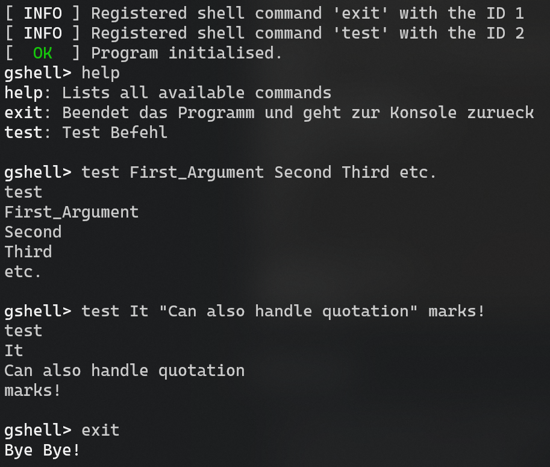

# GShell - little shell / logger for embedded systems
## Overview
Basic uart shell for embedded systems. While it has been initially developed for the AVR microcontrollers, it can be used with pretty much any controller or on computers as long as you provide the nessesary `printChar` function. 

## Features
 - Should run on most microcontrollers with no changes
 - Configureable via define-macros
 - Supports basic VT100 Coloring
 - Nicely printed shell logging
 - Ease of use to add additional commands
 - Supports both static command lists or dynamically added commands
 - Handles Quotation-Marks to pass larger arguments to the commands
## Usage
In order to use the library, simply initialise `gs_init` with a function pointer to a printCharacter-function. Optionally you can also pass over a millisecond-timestamp/tick function, in order to add timelogging capabilities on the logging functions.

From there, simply call `gshell_processShell` (in your `main` function) with the received character from the UART or USB-CDC driver. Any called command can return a value, which is passed back to `gshell_processShell`, which returns it back to the programmer, allowing basic information exchange between executed commands and the main function.

A lot of work has been put into documentation of the header and c file, please take a look in the header file to get a detailed information about each function, required arguments and possible return values. Alternatively, take a look at the included main.c file, which should give a good insight of the shell's capabilities.